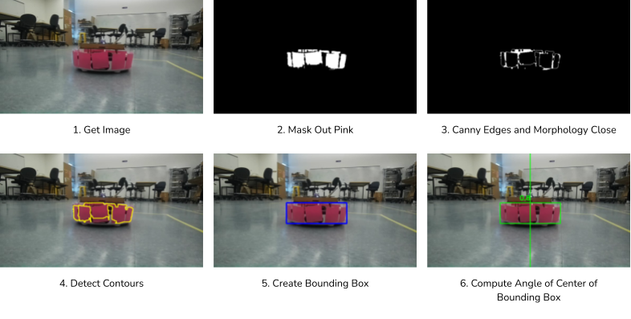

## Neato Tag Logic

### Chaser Logic

- **Camera Input:**  
  Subscribe to the chaser Neato’s camera feed.

- **Image Processing:**  
  Convert ROS image messages to OpenCV images.

- **Color Detection:**  
  Detect the runner Neato using color-based detection and return a bounding box.

- **Motion Calculation:**
  - If the runner is detected, compute the heading angle from the bounding box center and drive toward it.
  - If the runner is not detected, rotate in place in the last known direction of search.

- **Publish Command:**  
  Publish linear and angular velocity commands to the chaser Neato.

#### Upon Bump (Tag)

- **Immediate Stop:**  
  Publish a stop command to the chaser Neato.

- **Role Swap:**
  - Publish a swap signal to the runner over `/swap_role`
  - Swap the names of the chaser and runner Neatos within the chaser code

- **Re-setup:**  
  Reinitialize subscriptions and publishers for the new chaser.

- **Wait Period:**  
  Pause chaser movement for a short duration before restarting the chase.

---

### Runner Logic

- **Keyboard Input:**  
  Read user key presses and map them to linear and angular velocity commands.

- **Publish Command:**  
  Publish linear and angular velocity commands to the runner Neato.

#### Upon Swap Signal (`/swap_roles`)

- **Role Swap:**  
  Swap the names of the chaser and runner Neatos within the runner code.

- **Re-setup:**  
  Reinitialize the velocity publisher for the new runner.

---

## Color Detection Logic

1. Get an image from the camera.
2. Mask out all colors except those within a specified range around a neon pink color.
3. Apply Canny edge detection and morphological closing to fill gaps.
4. Retrieve contours and extract rectangles using `cv2.findContours`.
5. Remove rectangles below a size threshold and merge the remaining ones into a single bounding box.
6. Compute the angle of the bounding box center using the camera’s field of view (FOV).
